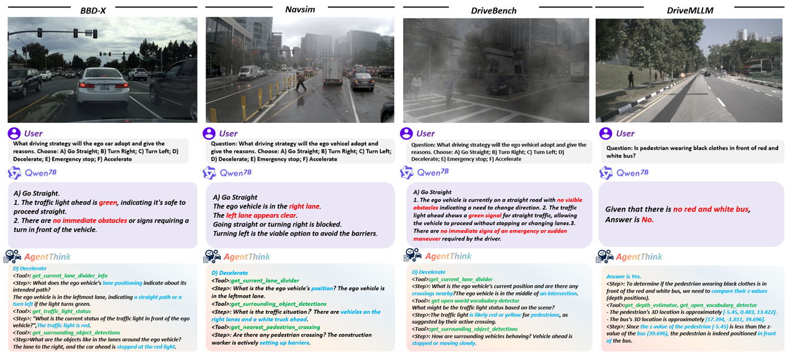
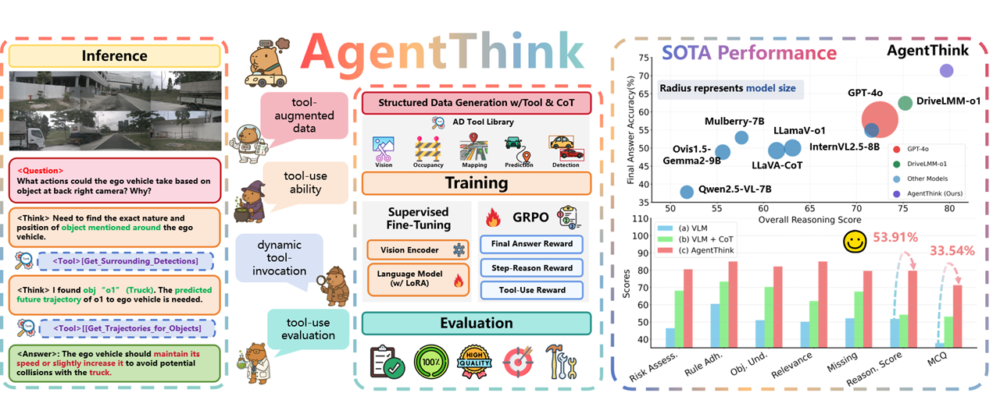

# AgentThink: A Tool-Augmented Visual Language Reasoning Framework for Autonomous Driving

---

During the development of AgentThink, we drew inspiration from ancient wisdom. As stated by Xunzi:
> 📜 "A gentleman is not inherently different from others; he excels by skillfully leveraging external tools."
>
> This philosophy aligns perfectly with our design principles - by integrating multiple tools and models, AgentThink achieves superior understanding and response capabilities in complex autonomous driving scenarios.

[中文](README_CN.md) ｜ **English**

<div align="center">


<p>
  <a href="https://agentthink.github.io">🌐 Project Homepage</a> •
  <a href="https://arxiv.org/pdf/2505.15298">📄 Paper Link</a> •
  <a href="https://github.com/agentthink/agentthink/releases/tag/v1.1">🔖 Latest Version v1.1</a> •
  <a href="LICENSE">🪪 License</a>
</p>

</div>

## 🎬 Demo Showcase

Experience AgentThink's real-world performance through our demonstration materials that illustrate its capabilities in autonomous driving scenarios.

### Video Demonstration

Watch this video to see AgentThink's environmental perception in complex traffic conditions:

<p align="center">
  <a href="https://youtu.be/your_video_id" target="_blank">
    
  </a>
</p>

> **Tip**: Click the image to play. For alternative viewing options, visit our [Bilibili](#) channel.

### Visualization Gallery
<!-- 横向对比图 -->
<div style="display: flex; justify-content: center; flex-wrap: wrap; gap: 20px; margin: 20px 0;">
  
  
</div>

<!-- 单张展示图 -->
<p style="text-align: center; margin: 25px 0;">
  
</p>

Complementing the video, these visualizations demonstrate key capabilities:

| Scenario | Description | Image |
| --- | --- | --- |
| High-level planning | Visualizes high-level planning | [View](assets/planning.png) |
| Spatial Understanding | Demonstrates spatial relationship analysis | [View](assets/demo_path_planning.png) |
| Environment Adaptability | Shows performance in adverse weather or low-light| [View](assets/planning-night.png) |


---

## Contents
- [✨ Highlights](#-highlights)
- [📰 Project Updates](#-project-updates)
- [🚀 Quick Navigation](#-quick-navigation)
- [⚙️ Getting Started](#️-getting-started)
- [🚀 Quick Start](#-quick-start)
- [📋 TODO List](#-todo-list)
- [📂 Repository Structure](#-repository-structure)
- [📊 Benchmark Results](#-benchmark-results)
- [🖼️ Paper Results](#️-paper-results)
- [📜 License & Citation](#-license--citation)

## ✨ Highlights

- 🔧 **Tool-Augmented Reasoning**: Multi-modal perception through integrated vision, prediction, occupancy, and mapping tools  
- 🧠 **Reasoning Chain + Tool Calls**: Task decomposition with explicit tool invocation  
- 🎯 **GRPO Training**: Triple reward signals (final answer, step-wise, tool usage)  
- 🚀 **Performance Boost**: 53.91% accuracy improvement over traditional VLM models

<div align="center">
  
</div>

## 📰 Project Updates

- 📄 [2025.05.22] Paper published on arXiv
- 🚀 [2025.07.02] v1.1 released with demo and sample data
- 🎥 Web Demo and Swift full training pipeline coming soon

## 🚀 Quick Navigation
| Section | Description | Link |
|--------|-------------|------|
| Environment Setup | Install dependencies | [Setup Guide](#️-getting-started) |
| Training | Swift training scripts | [Training](#training-launch) |
| Demo | Real-time inference | [Run Demo](#demo-inference) |
| Benchmarks | Performance comparison | [Results](#-benchmark-results) |

## ⚙️ Getting Started

### Environment Setup
```bash
# Create virtual environment
conda create -n agentthink python=3.10
conda activate agentthink

# Install dependencies
pip install -r requirements.txt

# Install tool libraries
cd tools/visualization
pip install -e .
```

## 🚀 Quick Start
### Demo Inference
```bash
python AgentThink/Inference/inference_demo_data_drivemllm.json
```

## 📋 TODO List

### 🔧 Development Roadmap
| Status | Task Description                   | 
|-------|------------------------------------|
| ✅    | AgentThink demo implementation     | 
| 🔜    | General reasoning evaluation metrics | 
| 🔜    | Tool-specific evaluation metrics   | 
| 🔜    | Data preprocessing pipeline        | 
| ✅    | Debug example implementation       | 
| 🔜    | Multi-stage training framework     | 
| 🔜    | Tool function interaction environment | 

## 📊 Benchmark Results

### DriveLMM-o1 Performance
| Vision Language Models | Risk Assess. (%)↑ | Rule Adh. (%)↑ | Scene Aware. (%)↑ | Relevance (%)↑ | Missing (%)↑ | Reason. (%)↑ | MCQ (%)↑ |
|------------------------|-------------------|----------------|--------------------|-----------------|--------------|--------------|----------|
| [GPT-4o](https://github.com/example/GPT-4o) [16] | 71.32             | 80.72          | 72.96              | 76.65           | 71.43        | 72.52        | 57.84    |
| [Ovis1.5-Gemma2-9B](https://github.com/example/Ovis1.5-Gemma2-9B) [21] | 51.34            | 66.36          | 54.74              | 55.72           | 55.74        | 55.62        | 48.85    |
| [Mulberry-7B](https://github.com/example/Mulberry-7B) [45] | 51.89            | 63.66          | 56.68              | 57.27           | 57.45        | 57.65        | 52.86    |
| [LLaVA-CoT](https://github.com/example/LLaVA-CoT) [43] | 57.62            | 69.01          | 60.84              | 62.72           | 60.67        | 61.41        | 49.27    |
| [LlamaV-o1](https://github.com/example/LlamaV-o1) [34] | 60.20            | 73.52          | 62.67              | 64.66           | 63.41        | 63.13        | 50.02    |
| [InternVL2.5-8B](https://github.com/example/InternVL2.5-8B) [4] | 69.02           | 78.43          | 71.52              | 75.80           | 70.54        | 71.62        | 54.87    |
| [Qwen2.5-VL-7B](https://github.com/example/Qwen2.5-VL-7B) [1] | 46.44           | 60.45          | 51.02              | 50.15           | 52.19        | 51.77        | 37.81    |
| [DriveLMM-o1](https://github.com/example/DriveLMM-o1) [15] | 73.01           | 81.56          | 75.39              | 79.42           | 74.49        | 75.24        | 62.36    |
| **AgentThink (Ours)** | **80.51**         | **84.98**      | **82.11**          | **84.99**       | **79.56**    | **79.68**    | **71.35** |

### DriveMLLM Comparison

| Type       | Model                                                                 | L/R    | F/B    | RHD   | RD     | PPos  | BBox  | CVD   | CD     | AccS  | Overall |
|------------|-----------------------------------------------------------------------|--------|--------|-------|--------|-------|-------|-------|--------|-------|---------|
| Zero-shot  | [GPT-4o](https://github.com/example/GPT-4o) [16]                     | 91.72  | 67.60  | 9.58  | 14.69  | 40.90 | 4.07  | 46.11 | 70.65  | 43.16 | 25.63   |
|            | [GPT-4o-mini](https://github.com/example/GPT-4o-mini)                | 67.67  | 50.13  | 70.44 | 0.00   | 29.28 | 3.78  | 0.00  | 46.40  | 33.46 | 16.68   |
|            | [LLaVA-ov-72B](https://github.com/example/LLaVA-ov-72B) [19]          | 85.42  | 49.48  | 13.76 | 45.27  | 16.46 | 0.00  | 42.97 | 27.09  | 35.06 | 21.10   |
|            | [Qwen2.5-VL-7B](https://github.com/example/Qwen2.5-VL-7B) [1]         | 76.55  | 55.24  | 7.14  | 17.11  | 55.97 | 38.31 | 55.94 | 51.52  | 44.72 | 13.36   |
|            | [Qwen + CoT](https://github.com/example/Qwen-CoT)                    | 87.06  | 63.09  | 16.69 | 22.56  | 52.51 | 38.87 | 76.90 | 38.71  | 49.55 | 19.31   |
|            | [Qwen + DirectTool](https://github.com/example/Qwen-DirectTool)       | 78.95  | 48.96  | 58.43 | 67.57  | 58.20 | 42.22 | 51.76 | 51.38  | 57.18 | 24.05   |
|            | **AgentThink (Ours)**                                                 | 82.33  | 54.40  | 56.14 | 61.45  | 70.45 | 56.23 | 23.09 | 51.60  | 56.96 | 26.52   |
| One-shot   | [GPT-4o](https://github.com/example/GPT-4o)                           | 91.08  | 69.37  | 36.51 | 71.17  | 42.44 | 5.10  | 0.00  | 63.88  | 47.44 | 33.17   |
|            | [GPT-4o-mini](https://github.com/example/GPT-4o-mini)                 | 66.00  | 48.95  | 83.02 | 58.47  | 25.71 | 3.97  | 52.73 | 55.23  | 49.26 | 22.13   |
|            | [LLaVA-ov-72B](https://github.com/example/LLaVA-ov-72B) [19]           | 79.12  | 62.97  | 49.26 | 68.04  | 28.57 | 2.20  | 53.12 | 60.90  | 50.52 | 36.66   |
|            | [Qwen2.5-VL-7B](https://github.com/example/Qwen2.5-VL-7B) [1]         | 80.30  | 53.14  | 36.96 | 39.13  | 62.69 | 22.63 | 49.88 | 48.32  | 49.13 | 33.53   |
|            | [Qwen + CoT](https://github.com/example/Qwen-CoT)                    | 86.35  | 59.95  | 43.29 | 31.81  | 53.64 | 26.93 | 51.02 | 42.30  | 49.41 | 32.06   |
|            | [Qwen + DirectTool](https://github.com/example/Qwen-DirectTool)       | 84.57  | 55.50  | 67.32 | 59.54  | 85.58 | 26.07 | 52.34 | 53.25  | 60.52 | 42.27   |
|            | **AgentThink (Ours)**                                                 | 78.71  | 48.46  | 60.64 | 60.71  | 72.36 | 64.46 | 52.26 | 52.04  | 61.21 | 47.24   |

## 📁 Repository Structure
```
AgentThink/
├── tools/               # Tool library implementations
├── AgentThink/          # Core framework
├── benchmarks/          # Evaluation benchmarks
├── docs/                # Documentation resources
└── assets/              # Visual assets
```

## 🪪 License & Citation

### License
This project is licensed under [Apache License 2.0](https://www.apache.org/licenses/LICENSE-2.0). See LICENSE file for details.

### Citation
Please cite our work if you use AgentThink in your research:
```bibtex
@misc{qian2025agentthinkunifiedframeworktoolaugmented,
      title={AgentThink: A Unified Framework for Tool-Augmented Chain-of-Thought Reasoning in Vision-Language Models for Autonomous Driving}, 
      author={Kangan Qian et al.},
      year={2025},
      eprint={2505.15298},
      archivePrefix={arXiv},
      url={https://arxiv.org/abs/2505.15298}, 
}
```