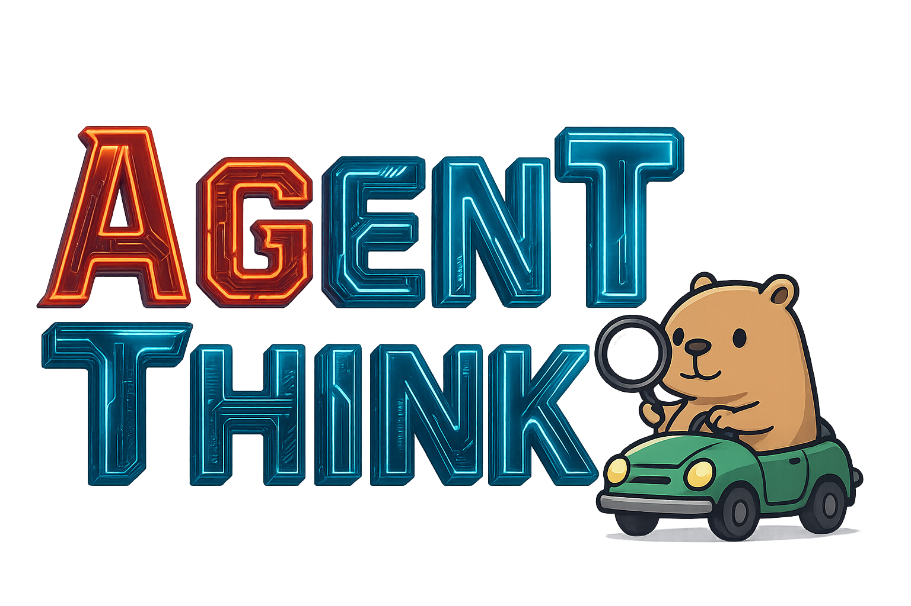
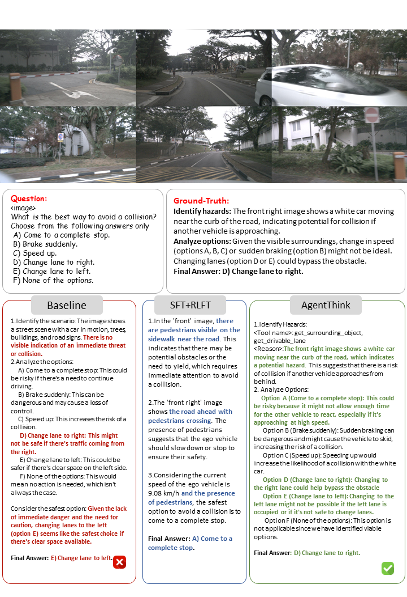
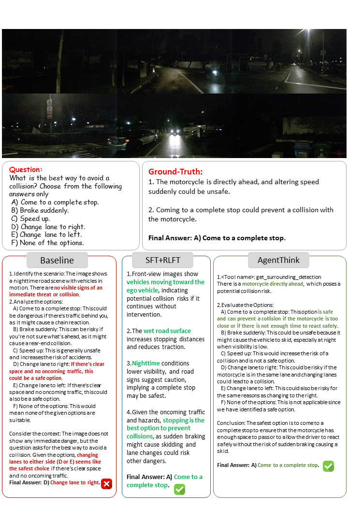
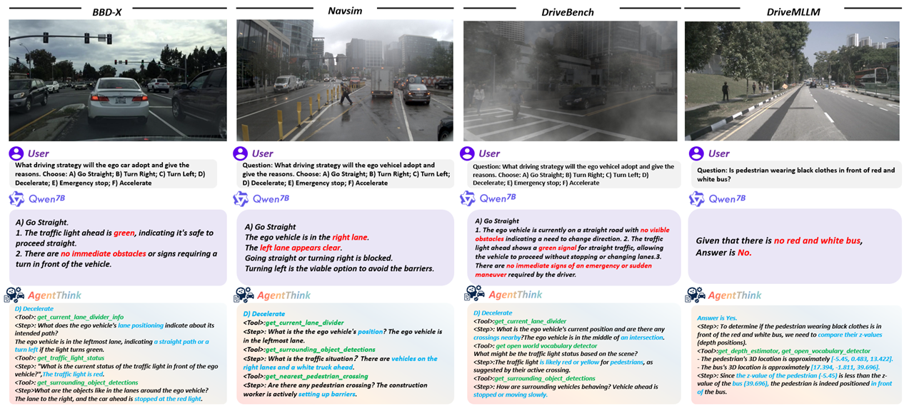
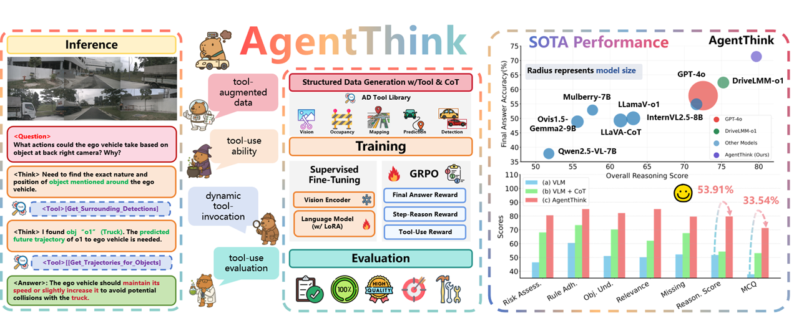

# AgentThink：用于自动驾驶的工具增强视觉语言推理框架

联系邮箱：qka23@mails.tsinghua.edu.cn

在开发AgentThink的过程中，我们深受古代智慧的启发。正如荀子所言：
> 📜「君子生非异也，善假于物也。」
>
> 这句话意指：君子之所以能成为君子，并非天资异禀，而是善于借助工具的力量。这与AgentThink的设计理念完美契合——通过集成多种外部工具与模型，AgentThink能够在复杂的自动驾驶场景下实现卓越的认知和决策能力。

---
**中文** ｜ [English](README.md)

<div align="center">



<p>
  <a href="https://agentthink.github.io">🌐 项目主页</a> •
  <a href="https://arxiv.org/pdf/2505.15298">📄 论文链接</a> •
  <a href="https://github.com/agentthink/agentthink/releases/tag/v1.1">🔖 最新版本 v1.1</a> •
  <a href="LICENSE">🪪 开源协议</a>
</p>

</div>

## 🎬 Demo演示

体验AgentThink在自动驾驶场景下的实际表现：

### 视频演示

<p align="center">
  
</p>

### 可视化画廊

<div style="display: flex; justify-content: center; flex-wrap: wrap; gap: 20px; margin: 20px 0;">
  
  
</div>

<p style="text-align: center; margin: 25px 0;">
  
</p>

| 场景           | 描述                  | 图像                                     |
|----------------|----------------------|------------------------------------------|
| 高级路径规划    | 展示高层级路径规划能力 | [查看](assets/planning.png)              |
| 空间理解        | 空间关系分析与推理     | [查看](assets/demo_path_planning.png)    |
| 环境适应能力    | 极端天气/弱光下的表现  | [查看](assets/planning-night.png)        |

---

## 目录
- [✨ 项目亮点](#-项目亮点)
- [📰 项目动态](#-项目动态)
- [🚀 快速导航](#-快速导航)
- [🛠️ 环境配置](#-环境配置)
- [🎬 模型推理](#-模型推理)
- [📊 评估与指标](#-评估与指标)
- [🏆 Benchmark结果](#-benchmark结果)
- [⚙️ 环境要求](#-环境要求)
- [🚀 快速上手](#-快速上手)
- [📋 TODO列表](#-todo列表)
- [📁 仓库结构](#-仓库结构)
- [🔗 相关开源项目](#-相关开源项目)
- [🪪 许可证与引用](#-许可证与引用)

## ✨ 项目亮点

- 🔧 **工具增强推理**：集成视觉、预测、占用、地图等多模态感知工具
- 🧠 **推理链与工具调用**：任务分解，显式多步调用外部工具
- 🎯 **GRPO训练**：结合终答、步骤、工具三重奖励信号
- 🚀 **性能跃升**：比传统VLM提升53.91%推理准确率

<div align="center">
  
</div>

## 📰 项目动态
- 🎉 [2025.08.20] 论文被 EMNLP2025 Fundings 接收
- 🚀 [2025.07.02] 发布 v1.1，支持 Demo 与样例数据
- 📄 [2025.05.22] 论文上线 arXiv
- 🎥 Web Demo 与 Swift 全流程训练即将开源

---

## 🚀 快速导航

| 模块            | 描述                          | 跳转链接                           |
|-----------------|-------------------------------|------------------------------------|
| 环境配置        | 安装依赖和环境准备             | [环境配置](#环境配置)              |
| 模型推理        | 在验证集上进行推理             | [模型推理](#模型推理)              |
| Demo推理        | 测试集实时推理脚本             | [Demo推理](#demo推理)              |
| 评估与指标      | 使用LLM-as-Judge评测           | [评估与指标](#评估与指标)          |
| Benchmark结果   | 各方法定量性能对比             | [Benchmark结果](#benchmark结果)    |

---

## 环境配置

### 🛠️ 基础环境要求
| 组件         | 版本           | 检查命令                           |
|--------------|----------------|------------------------------------|
| 操作系统     | Ubuntu 20.04   | `cat /etc/issue`                   |
| Python       | 3.10.12        | `python --version`                 |
| CUDA Toolkit | 12.4           | `nvcc --version`                   |
| GPU驱动      | 535.129.03     | `nvidia-smi | grep "Driver Version"`|
| PyTorch      | 2.6.0          | `print(torch.__version__)`         |

### 🛠️ 环境搭建
```bash
conda create -n agentthink python=3.10
conda activate agentthink
pip install -r requirements.txt
bash scripts/env.sh
bash scripts/env_drivemllm.sh
````

### 克隆ms-swift

```bash
cd third_party
git clone https://github.com/modelscope/ms-swift.git
```

---

## 模型推理
🎬 使用已训练的模型进行验证集推理：

```bash
# 标准推理脚本
bash scripts/inference_scripts/inference.sh [你的CKPT路径] [你的输出目录]

# 工具增强推理脚本
bash scripts/inference_scripts/inference_withtool.sh [你的CKPT路径] [你的输出目录]

# 多卡推理
bash scripts/inference_scripts/inference_multigpu.sh [你的CKPT路径] [你的输出目录]

# AgentThink最强推理脚本
bash scripts/inference_agentthink.sh [你的CKPT路径] [你的输出目录]
```

---

## 评估与指标

📊 使用 LLM-as-Judge 进行模型表现量化：

```bash
# 推理和多选题评价
python evaluation/evaluation_script.py
```

---

## Benchmark结果

🏆 详见[Benchmark结果](#benchmark结果)或论文海报，AgentThink在各大任务维度显著领先。

### DriveLMM-o1 性能

| 视觉语言模型                                            | 风险评估(%)   | 规则遵守(%)   | 场景感知(%)   | 相关性(%)    | 缺失(%)     | 推理(%)     | MCQ(%)    |
| ------------------------------------------------- | --------- | --------- | --------- | --------- | --------- | --------- | --------- |
| [GPT-4o](https://github.com/example/GPT-4o) [16] | 71.32             | 80.72          | 72.96              | 76.65           | 71.43        | 72.52        | 57.84    |
| [Ovis1.5-Gemma2-9B](https://github.com/example/Ovis1.5-Gemma2-9B) [21] | 51.34            | 66.36          | 54.74              | 55.72           | 55.74        | 55.62        | 48.85    |
| [Mulberry-7B](https://github.com/example/Mulberry-7B) [45] | 51.89            | 63.66          | 56.68              | 57.27           | 57.45        | 57.65        | 52.86    |
| [LLaVA-CoT](https://github.com/example/LLaVA-CoT) [43] | 57.62            | 69.01          | 60.84              | 62.72           | 60.67        | 61.41        | 49.27    |
| [LlamaV-o1](https://github.com/example/LlamaV-o1) [34] | 60.20            | 73.52          | 62.67              | 64.66           | 63.41        | 63.13        | 50.02    |
| [InternVL2.5-8B](https://github.com/example/InternVL2.5-8B) [4] | 69.02           | 78.43          | 71.52              | 75.80           | 70.54        | 71.62        | 54.87    |
| [Qwen2.5-VL-7B](https://github.com/example/Qwen2.5-VL-7B) [1] | 46.44           | 60.45          | 51.02              | 50.15           | 52.19        | 51.77        | 37.81    |
| [DriveLMM-o1](https://github.com/example/DriveLMM-o1) [15] | 73.01           | 81.56          | 75.39              | 79.42           | 74.49        | 75.24        | 62.36    |
| **AgentThink (Ours)** | **80.51**         | **84.98**      | **82.11**          | **84.99**       | **79.56**    | **79.68**    | **71.35** |

#### DriveMLLM对比

| 类型             | 模型  | L/R | F/B | RHD | RD  | PPos | BBox | CVD | CD  | AccS | Overall |
| -------------- | --- | --- | --- | --- | --- | ---- | ---- | --- | --- | ---- | ------- |
| Zero-shot  | [GPT-4o](https://github.com/example/GPT-4o) [16]                     | 91.72  | 67.60  | 9.58  | 14.69  | 40.90 | 4.07  | 46.11 | 70.65  | 43.16 | 25.63   |
|            | [GPT-4o-mini](https://github.com/example/GPT-4o-mini)                | 67.67  | 50.13  | 70.44 | 0.00   | 29.28 | 3.78  | 0.00  | 46.40  | 33.46 | 16.68   |
|            | [LLaVA-ov-72B](https://github.com/example/LLaVA-ov-72B) [19]          | 85.42  | 49.48  | 13.76 | 45.27  | 16.46 | 0.00  | 42.97 | 27.09  | 35.06 | 21.10   |
|            | [Qwen2.5-VL-7B](https://github.com/example/Qwen2.5-VL-7B) [1]         | 76.55  | 55.24  | 7.14  | 17.11  | 55.97 | 38.31 | 55.94 | 51.52  | 44.72 | 13.36   |
|            | [Qwen + CoT](https://github.com/example/Qwen-CoT)                    | 87.06  | 63.09  | 16.69 | 22.56  | 52.51 | 38.87 | 76.90 | 38.71  | 49.55 | 19.31   |
|            | [Qwen + DirectTool](https://github.com/example/Qwen-DirectTool)       | 78.95  | 48.96  | 58.43 | 67.57  | 58.20 | 42.22 | 51.76 | 51.38  | 57.18 | 24.05   |
|            | **AgentThink (Ours)**                                                 | 82.33  | 54.40  | 56.14 | 61.45  | 70.45 | 56.23 | 23.09 | 51.60  | 56.96 | 26.52   |
| One-shot   | [GPT-4o](https://github.com/example/GPT-4o)                           | 91.08  | 69.37  | 36.51 | 71.17  | 42.44 | 5.10  | 0.00  | 63.88  | 47.44 | 33.17   |
|            | [GPT-4o-mini](https://github.com/example/GPT-4o-mini)                 | 66.00  | 48.95  | 83.02 | 58.47  | 25.71 | 3.97  | 52.73 | 55.23  | 49.26 | 22.13   |
|            | [LLaVA-ov-72B](https://github.com/example/LLaVA-ov-72B) [19]           | 79.12  | 62.97  | 49.26 | 68.04  | 28.57 | 2.20  | 53.12 | 60.90  | 50.52 | 36.66   |
|            | [Qwen2.5-VL-7B](https://github.com/example/Qwen2.5-VL-7B) [1]         | 80.30  | 53.14  | 36.96 | 39.13  | 62.69 | 22.63 | 49.88 | 48.32  | 49.13 | 33.53   |
|            | [Qwen + CoT](https://github.com/example/Qwen-CoT)                    | 86.35  | 59.95  | 43.29 | 31.81  | 53.64 | 26.93 | 51.02 | 42.30  | 49.41 | 32.06   |
|            | [Qwen + DirectTool](https://github.com/example/Qwen-DirectTool)       | 84.57  | 55.50  | 67.32 | 59.54  | 85.58 | 26.07 | 52.34 | 53.25  | 60.52 | 42.27   |
|            | **AgentThink (Ours)**                                                 | 78.71  | 48.46  | 60.64 | 60.71  | 72.36 | 64.46 | 52.26 | 52.04  | 61.21 | 47.24   |

---

## 🚀 快速上手

### 下载模型

本项目AgentThink模型基于 Qwen2.5-VL-7B。

### 下载工具模型

克隆 DepthAnythingV2：

```bash
git clone https://github.com/DepthAnything/Depth-Anything-V2
```

克隆 YoloWorld：

```bash
git clone https://github.com/AILab-CVC/YOLO-World
```

并在 [YoloWorld](https://docs.ultralytics.com/zh/models/yolo-world/) 和 [DepthAnything](https://huggingface.co/depth-anything/Depth-Anything-V2-Base) 下载预训练模型。

### 下载工具结果

参考 [AgentDriver](https://github.com/USC-GVL/Agent-Driver) 获取 val.pkl 工具结果。

### 文件数据模型结构
```
AgentThink/
├── 📂 data/                    # 数据集和处理后的数据
    ├── DriveLMMo1_TEST_tool_results.jsonl
    ├── DriveLMMo1_TEST.jsonl
│   ├── 📂 image2concat/        # 拼接后的图像文件
│   └── 📂 tool_results/        # 工具处理结果

│
├── 📂 demo_image/              # 演示图像
│   ├── nuscenes_CAM_FRONT_3590.webp
│   ├── nuscenes_CAM_FRONT_3757.webp
│   └── nuscenes_CAM_FRONT_3896.webp
│
├── 📂 pretrained_model/        # 预训练模型文件
│   ├── 📂 AgentThink/
│   │   └── checkpoint-700-merged
│   ├── depth_anything_v2_vitb.pth
│   └── yolov8x-world2.pt
│
├── 📂 assets/                  # 视觉资源和素材
├── 📂 evaluation/              # 评估脚本和基准测试
├── 📂 Inference/               # 推理相关脚本和数据
├── 📂 results/                 # 输出和结果文件
├── 📂 scripts/                 # 各种工具脚本
├── 📂 third_party/             # 第三方库和资源
├── README.cn.md                # 中文文档
├── README.md                   # 项目文档
├── requirements.txt            # Python依赖项
└── ...                         # 其他项目文件
```
### Demo推理

```bash
# drivemllm
python Inference/inference_demo_drivemllm.py

# drivelmm-o1
python Inference/inference_demo_drivelmm.py
```

---

## 📋 TODO列表

| 状态 | 任务描述               |
| -- | ------------------ |
| ✅  | AgentThink demo与推理 |
| ✅  | 通用推理评价指标           |
| 🔜 | 工具评价指标             |
| 🔜 | 数据预处理              |
| ✅  | debug示例实现          |
| 🔜 | 多阶段训练框架            |
| 🔜 | 工具函数交互环境           |

---

## 📁 仓库结构

```
AgentThink/
├── assets/                 # 资源与可视化
├── data/                   # 数据集
├── evaluation/             # 评测与benchmarks
│   ├── evaluation_script.py
│   └── inference_agentthink.py
├── Inference/              # 推理脚本
│   ├── inference_demo_data_drivemllm.json
│   ├── inference_demo_data_drivelmm.json
│   └── inference_demo_drivemllm.py
├── results/                # 输出与结果
│   └── agentthink/
├── scripts/                # 工具脚本
│   ├── debug_scripts/
│   ├── inference_scripts/
│   └── tools/
├── third_party/            # 第三方库
│   ├── 🐍 inference.py         # 主推理脚本
│   ├── 🐍 prepare_data.py      # 数据预处理
│   ├── 🐍 utlis.py             # 工具函数
│   ├── 🐚 env.sh               # 环境脚本
│   ├── 🐚 env_drivemllm.sh     # DriveMLLM环境脚本
│   └── 🐚 prepare_json_data.sh # 大JSON数据准备
├── 📄 README.md            # 英文文档
├── 📄 README_CN.md         # 中文文档
├── 📄 requirements.txt     # 依赖
```

---

## 🔗 相关开源项目

| 名称                | 简介        | 链接                                                                           |
| ----------------- | --------- | ---------------------------------------------------------------------------- |
| Depth-Anything-V2 | 高质量单目深度估计 | [GitHub](https://github.com/DepthAnything/Depth-Anything-V2)                 |
| YOLO-World        | 开放词汇目标检测  | [GitHub](https://github.com/AILab-CVC/YOLO-World)                            |
| all-MiniLM        | 语义相似度模型   | [HuggingFace](https://huggingface.co/sentence-transformers/all-MiniLM-L6-v2) |
| AgentDriver       | 工具结果提供    | [Github](https://github.com/USC-GVL/Agent-Driver)                            |

---

## 🪪 许可证与引用

### License

本项目采用[Apache License 2.0](https://www.apache.org/licenses/LICENSE-2.0)开源协议，详情见 LICENSE 文件。使用时请保留原始版权声明和免责声明。

### Citation

如在学术研究中使用本项目，请引用如下：

```bibtex
@misc{qian2025agentthinkunifiedframeworktoolaugmented,
      title={AgentThink: A Unified Framework for Tool-Augmented Chain-of-Thought Reasoning in Vision-Language Models for Autonomous Driving}, 
      author={Kangan Qian and Sicong Jiang and Yang Zhong and Ziang Luo and Zilin Huang and Tianze Zhu and Kun Jiang and Mengmeng Yang and Zheng Fu and Jinyu Miao and Yining Shi and He Zhe Lim and Li Liu and Tianbao Zhou and Huang Yu and Yifei Hu and Guang Li and Guang Chen and Hao Ye and Lijun Sun and Diange Yang},
      year={2025},
      eprint={2505.15298},
      archivePrefix={arXiv},
      primaryClass={cs.RO},
      url={https://arxiv.org/abs/2505.15298}, 
}
```
